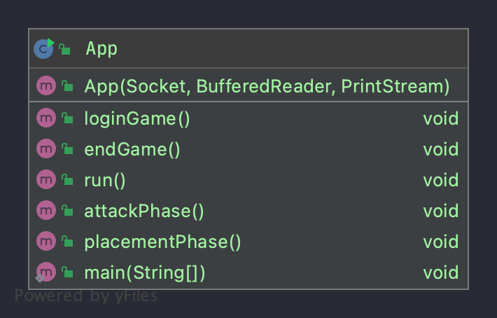
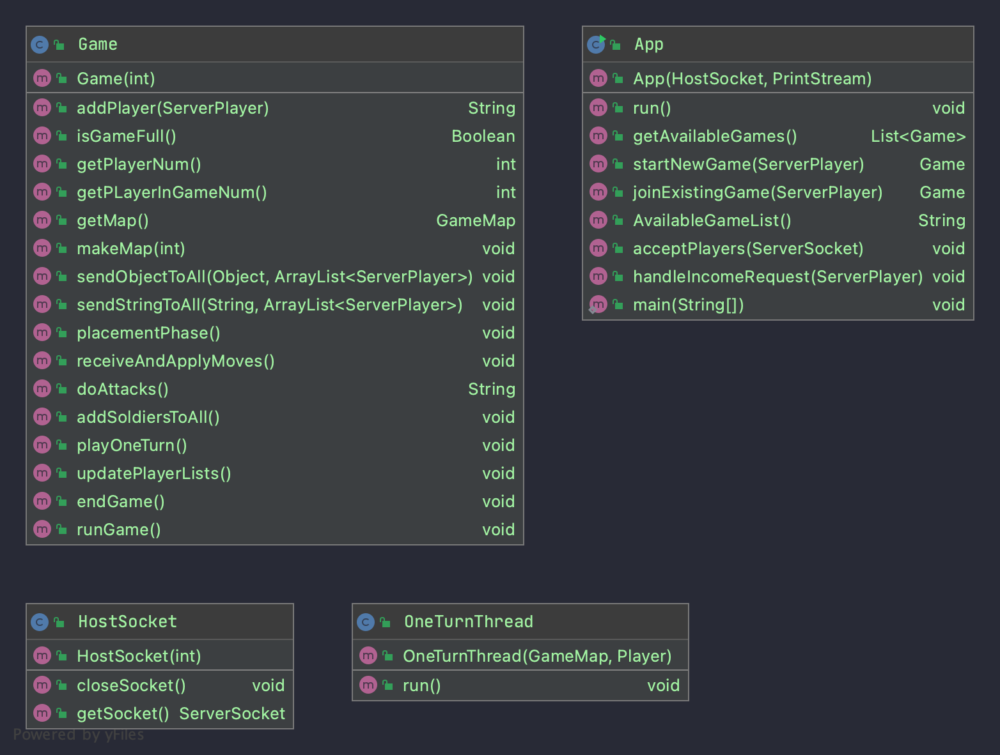
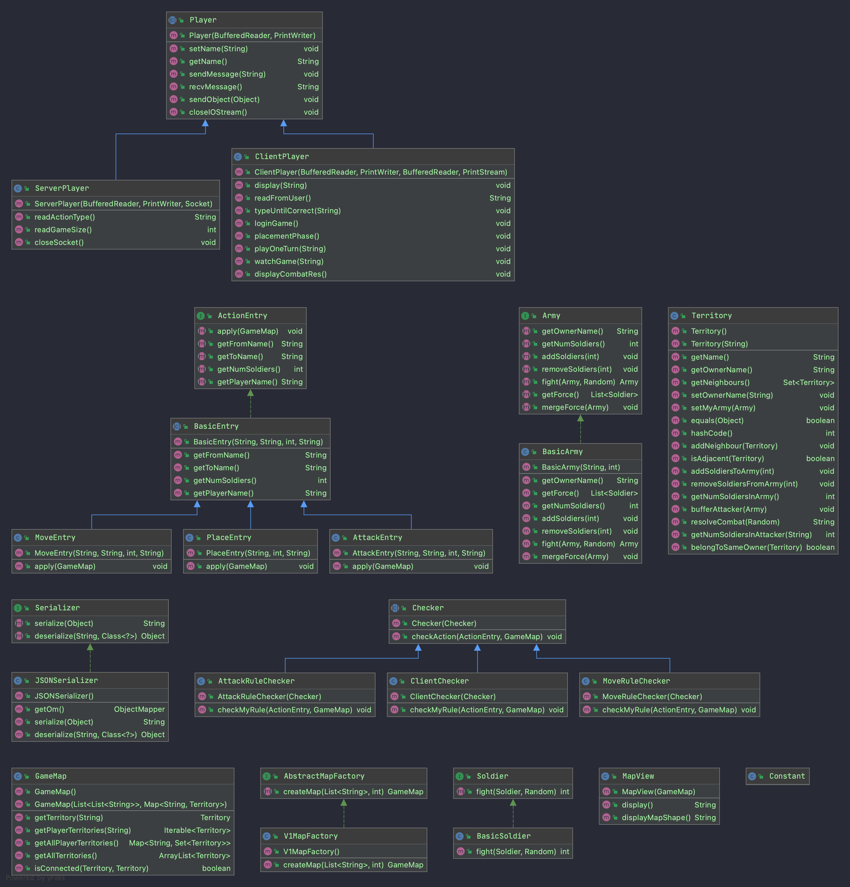

ECE 651: RISC
======================================

## Coverage
[Detailed coverage](https://yy252.pages.oit.duke.edu/ece651-spr21-group2-risc/dashboard.html)

## Deployment
Run `nc vcm-16514.vm.duke.edu 4444` can access the game server!

The version is the newest version of all branches. 

i.e. everytime after running CI/CD pipeline(no matter on which branch), the new code will be deployed on `vcm-16514.vm.duke.edu`.

## UML v1
- Client 

- Server

- Shared

## UX principles v2
<a href="./UX/UX_summary.pdf">
